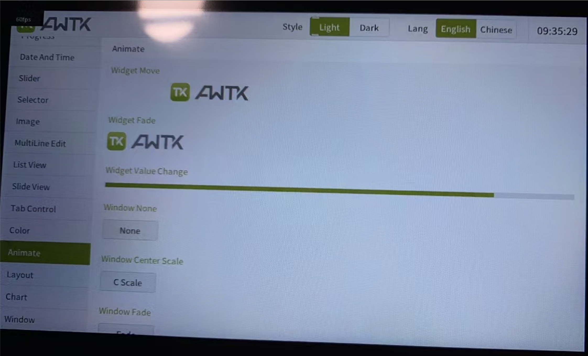

# awtk-tina-g2d

全志 Tina Linux 2D 图形加速插件。



> 开发环境为 全志 Tina Linux 虚拟机。

## 1. 准备

* 下载 awtk

```
git clone https://github.com/zlgopen/awtk.git
```

* 下载 awtk-linux-fb

```
git clone https://github.com/zlgopen/awtk-linux-fb.git
```

* 下载 awtk-tina-g2d

```
git clone https://github.com/zlgopen/awtk-tina-g2d.git
```

* 安装必要的开发工具

```
sudo apt-get install gcc g++ scons libsndio-dev libgtk-3-dev libglu1-mesa libglu1-mesa-dev libgl1-mesa-glx libgl1-mesa-dev libasound2-dev libibus-1.0-dev fcitx-libs-dev git vim clang-format libharfbuzz-dev nodejs libreadline-dev
```

## 2. 编译

* 编译 awtk-tina-g2d

```
cd awtk-tina-g2d
make
```

* 编译 awtk-linux-fb

```
cd awtk-linux-fb
scons TOOLS_PREFIX='arm-openwrt-linux-' WITH_CUSTOM_GRAPHIC_BUFFER=True \
  OS_LINKFLAGS='-L../awtk-tina-g2d/lib ' OS_LIBS="g2d" OS_FLAGS='-DWITH_G2D '
```  

## 3. 生成软件包

```
./release.sh
```

> 将生成的 release.tar.gz 拷贝到开发板并解压。

## 4. 运行

在开发板上运行。

```
cd release
./bin/demoui
```

出现下列 log 表示 g2d 已经启用：

```
g2d_tina_mem_create(146): ION_HEAP_TYPE 0x1
g2d_tina_mem_create(154): ION_IOC_ALLOC succes, dmabuf-fd = 0, size = 1024
```

## 5. 已知问题

cache flush 有些问题，总是失败，可能出现局部闪烁，请熟悉这部分功能的朋友不吝指教。
